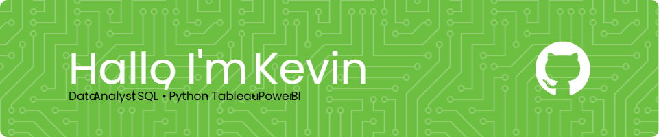

## Hello, I'm Kevin Muhammad Haikal 👋

<!--
**Kevinmhaikal/Kevinmhaikal** is a ✨ _special_ ✨ repository because its `README.md` (this file) appears on your GitHub profile.

Here are some ideas to get you started:

- 🔭 I’m currently working on ...
- 🌱 I’m currently learning ...
- 👯 I’m looking to collaborate on ...
- 🤔 I’m looking for help with ...
- 💬 Ask me about ...
- 📫 How to reach me: ...
- 😄 Pronouns: ...
- ⚡ Fun fact: ...
-->

- 🌱 I'm currently practicing coding challenges on [**HackerRank**](https://www.hackerrank.com/profile/kevinmuhhaikal) 📖

- 😄 He/Him

##### Skills

  

##### Connect with me

  

